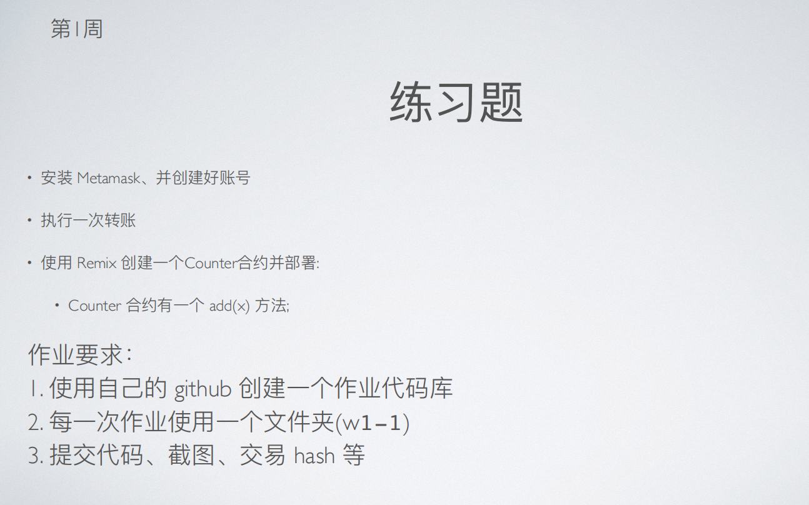
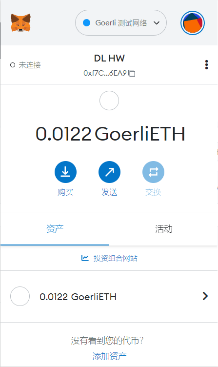
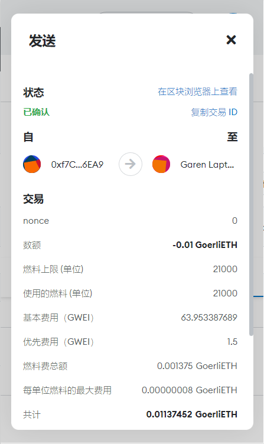
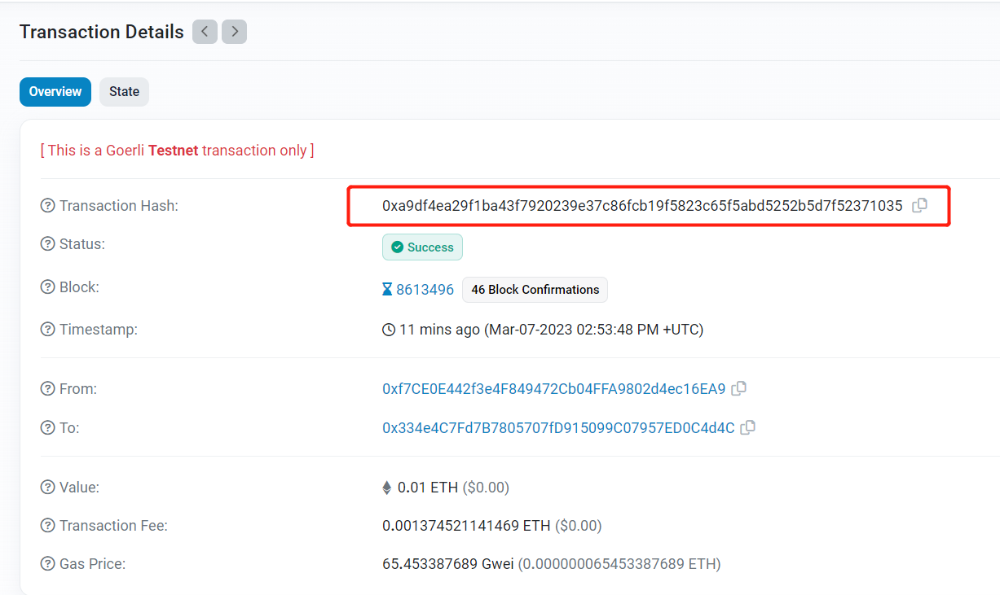
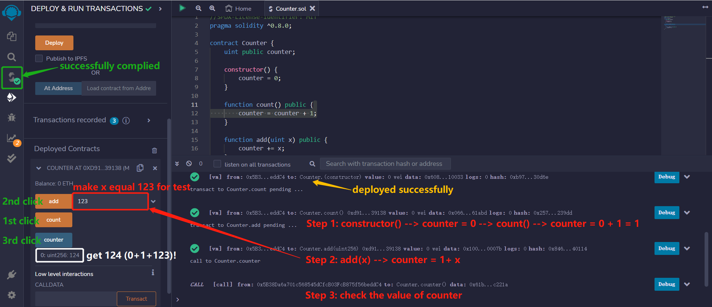

# 第 1 周第 1 课作业

## 1. 安装Metamask并创建钱包<br>
address = 0xf7ce0e442f3e4f849472cb04ffa9802d4ec16ea9<br>

<br><br>

## 2. 执行一次转账<br>

测试网转账发送0.01GoerliETH

From: 0xf7ce0e442f3e4f849472cb04ffa9802d4ec16ea9<br>

To: 0x334e4C7Fd7B7805707fD915099C07957ED0C4d4C<br>

<br><br>

## 3. 交易hash<br>

0xa9df4ea29f1ba43f7920239e37c86fcb19f5823c65f5abd5252b5d7f52371035<br><br>

## 4. 交易哈希（区块链浏览器中查阅）<br>

<br><br>

## 5. 使用remix创建Counter合约，添加add(x)方法，编译并部署合约<br>

``` solidity

//SPDX-License-Identifier: MIT
pragma solidity ^0.8.0;

contract Counter {
    uint public counter;

    constructor() {
        counter = 0;
    }

    function count() public {
        counter = counter + 1;
    }

    function add(uint x) public {
        counter += x;
    }
}
``` 


<br><br>
