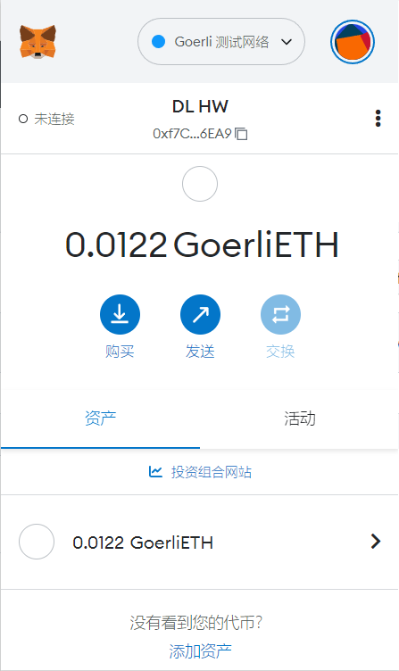
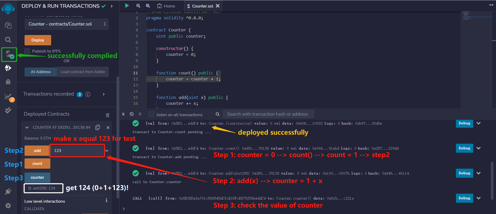

## 第1周 作业1  
### 已创建的Metamask钱包 
address = 0xf7ce0e442f3e4f849472cb04ffa9802d4ec16ea9 
  

### 执行一次转账 
  

### 交易hash 
0xa9df4ea29f1ba43f7920239e37c86fcb19f5823c65f5abd5252b5d7f52371035  

### 交易哈希（区块链浏览器中查阅） 
  

### 使用remix创建Counter合约并部署，添加add(x)方法 
  
