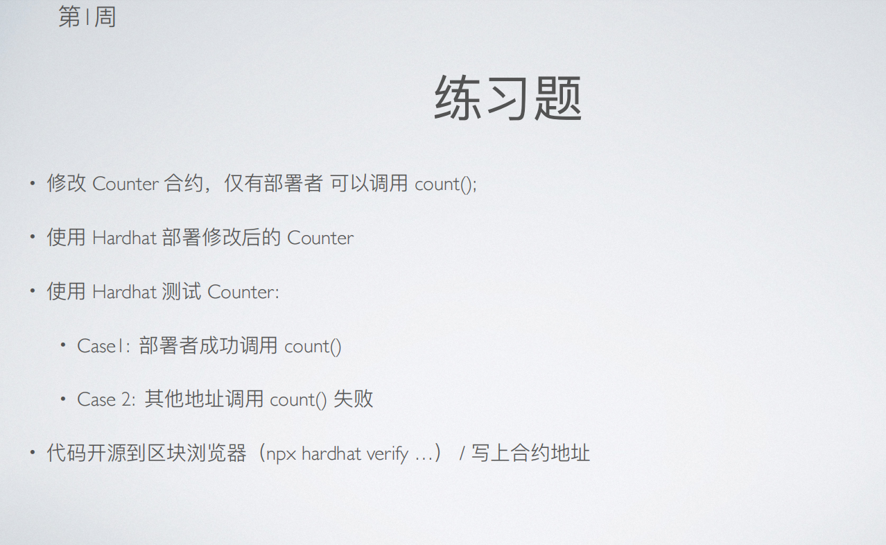
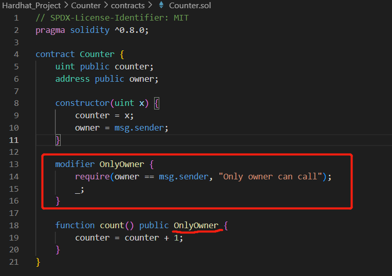
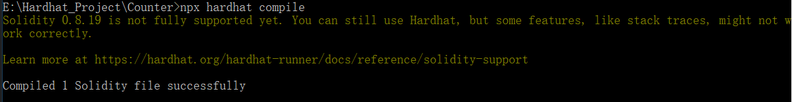
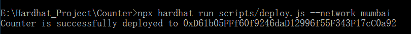
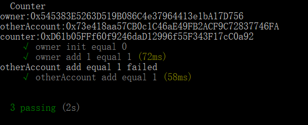
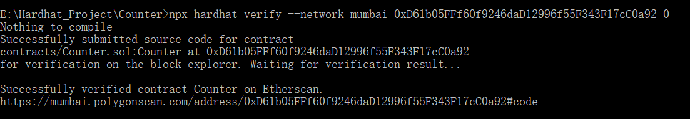
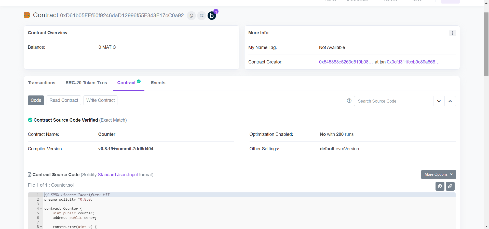

# 第 1 周第 2 课作业

## 1. 修改Counter合约，仅部署者可以调用count() 

增设了一个modifier函数修改器，用以规定调用者权限only owner 

  

## 2. 使用Hardhat部署修改后的Counter 

先编译完成：

  

然后将合约部署至Mumbai上：

  

## 3. 使用hardhat测试Counter 

设置了三个测试用例：
1. 测试初始值是否为0（初始赋值为0）；
2. 测试owner地址调用成功；
3. 测试非owner地址调用失败。
三个测试用例均通过。

  

## 4. 代码开源到区块链浏览器（mumbai.polygonscan.com） 

验证成功：
  

区块链浏览器中的验证合约：
  

URL: https://mumbai.polygonscan.com/address/0xD61b05FFf60f9246daD12996f55F343F17cC0a92#code
