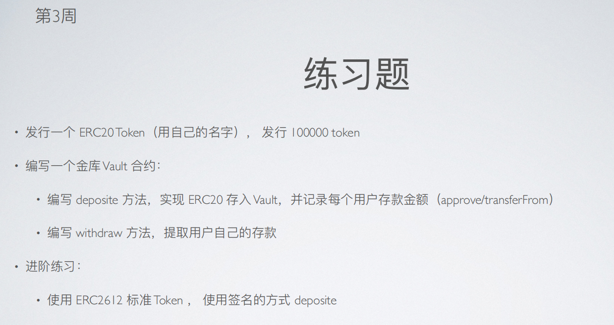
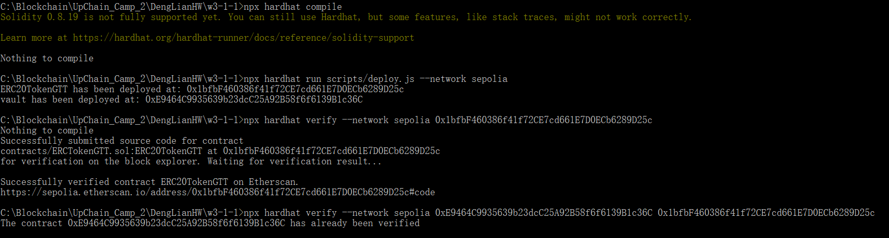
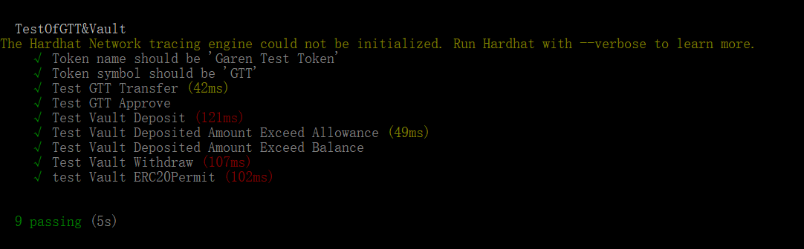
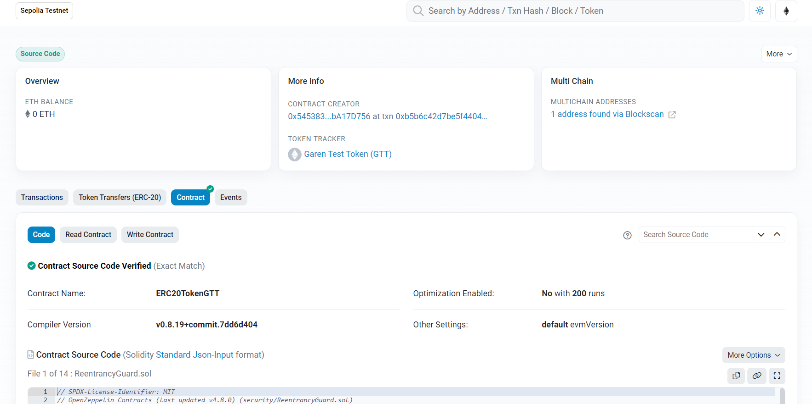
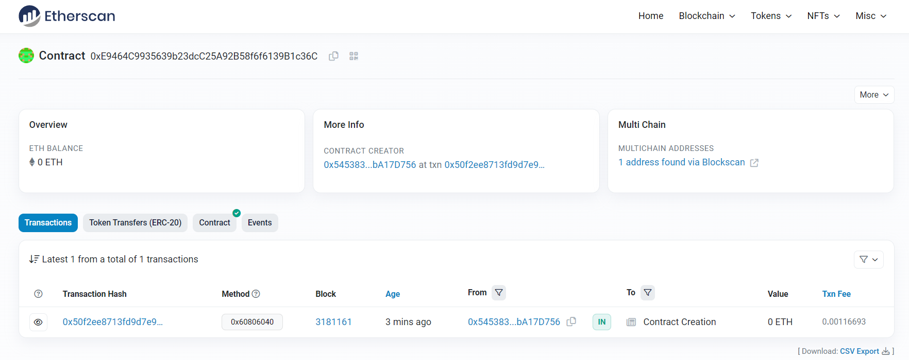

# 第 3 周第 1 课作业-第 1 个作业

## 1. 发行一个 ERC20Token (用自己的名字) ，发行 100000 token<br>

ERC20Token: Garen Test Token(GTT), network = sepolia<br>

GTT 补充了callback()方法，并继承了ERC20Permit(ERC2612)

```solidity
// SPDX-License-Identifier: MIT
pragma solidity ^0.8.1;

import "@openzeppelin/contracts/token/ERC20/ERC20.sol";
import "@openzeppelin/contracts/token/ERC20/extensions/draft-ERC20Permit.sol";
import "@openzeppelin/contracts/security/ReentrancyGuard.sol";
import "@openzeppelin/contracts/utils/Address.sol";

interface TokenRecipient {
    function tokensReceived(address sender, uint amount) external returns (bool);
}

contract ERC20TokenGTT is ERC20, ERC20Permit, ReentrancyGuard {
    using Address for address;
    address private owner;
    error NotOwner();

    constructor() ERC20("Garen Test Token", "GTT") ERC20Permit("Garen Test Token") {    // Token name is related to my alias —— Garen.
        owner = msg.sender;
        /// @dev totalsupply is 100,000
        _mint(msg.sender, 100000 * (10 ** uint256(decimals())));
    }

    // to realize callback function in ERC20 Token
    function transferWithCallback(address recipient, uint256 amount) external nonReentrant returns (bool) {
        _transfer(msg.sender, recipient, amount);    
        if (recipient.isContract()) {                                                  
            bool success = TokenRecipient(recipient).tokensReceived(msg.sender, amount);
            require(success, "No tokensReceived");
        }
        return true;
    }
}
```
## 2. 编写一个金库 Vault 合约:

- 编写 deposit 方法，实现 ERC20 存入 Vault，并记录每个用户存款金额 (approve/transferFrom)
- 编写 withdraw 方法，提取用户自己的存款
- 进阶练习：使⽤ ERC2612 标准 Token ，使⽤签名的⽅式 deposite。

 代码如下，补充了回调函数tokensReceived()和链下签名交易的方法permitDeposit()：

```solidity
// SPDX-License-Identifier: MIT
pragma solidity ^0.8.1;
import "@openzeppelin/contracts/token/ERC20/IERC20.sol";
import "@openzeppelin/contracts/token/ERC20/ERC20.sol";
import "@openzeppelin/contracts/token/ERC20/extensions/draft-ERC20Permit.sol";
import "@openzeppelin/contracts/token/ERC20/utils/SafeERC20.sol";

interface TokenRecipient {
    function tokensReceived(address sender, uint amount) external returns (bool);
}

contract Vault {
    using SafeERC20 for ERC20;
    mapping(address => uint256) public balance;
    ERC20 public token;
    error NotSpecifiedToken();
    error TransactionFailed();

    constructor(address _tokenAddress) {
        token = ERC20(_tokenAddress);
    }

    function getTokenSymbol() private view returns (string memory) {
        return token.symbol();
    }

    function deposit(uint256 amount) public {
        require(token.balanceOf(msg.sender) >= amount, "Insufficient balance");
        bool success = token.transferFrom(msg.sender, address(this), amount);
        if (!success) revert TransactionFailed();
        balance[msg.sender] += amount;
    }

    // ERC20-Permit(EIP2612): deposit with off-chain signiture
    function permitDeposit(uint256 amount, uint deadline, uint8 v, bytes32 r, bytes32 s) external {
        IERC20Permit(address(token)).permit(msg.sender, address(this), amount, deadline, v, r, s);
        deposit(amount);
    }

    function withdraw(uint256 amount) external {
        require(balance[msg.sender] >= amount, "Insufficient balance");
        balance[msg.sender] -= amount;
        token.safeTransfer(msg.sender, amount);
    }

    function getBalance(address _account) external view returns (uint256) {
        return token.balanceOf(_account);
    }

    // callback function 
    function tokensReceived(address sender, uint amount) external returns (bool) {
        require(msg.sender == address(token), "invalid");
        balance[sender] += amount;
        return true;
    }

}
```


## 3. ERC20Token合约与Vault合约的编译、部署、测试、验证<br>

使用hardhat将合约编译、部署、测试和验证，分别如下所示：<br>


<br><br>
<br><br>
<br><br>
<br><br>

ERC20TokenGTT合约: https://sepolia.etherscan.io/address/0x1bfbF460386f41f72CE7cd661E7D0ECb6289D25c#code<br>
Vault合约: https://sepolia.etherscan.io/address/0xE9464C9935639b23dcC25A92B58f6f6139B1c36C#code<br>

## 4. Garen Test Token(GTT) on Etherscan(sepolia)

.png)<br><br>

