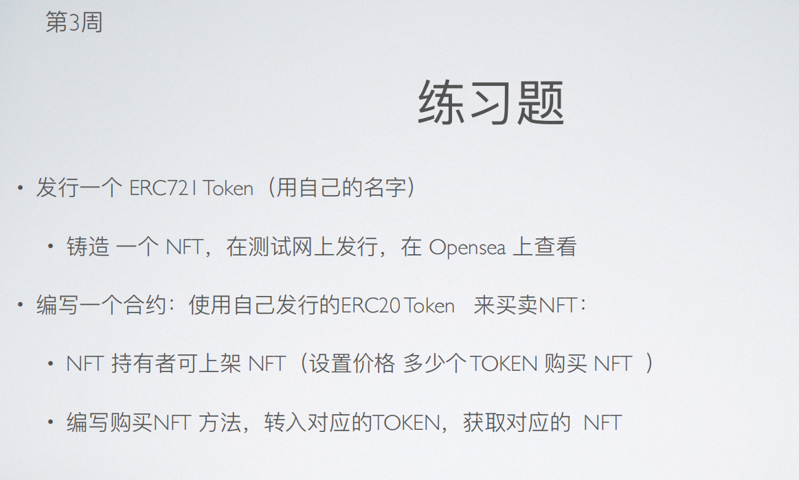
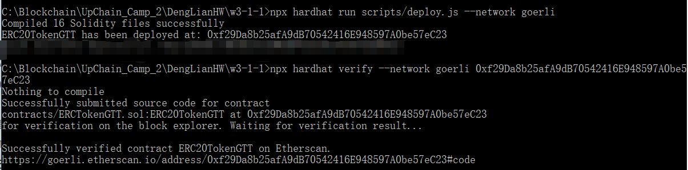
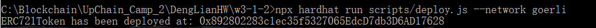
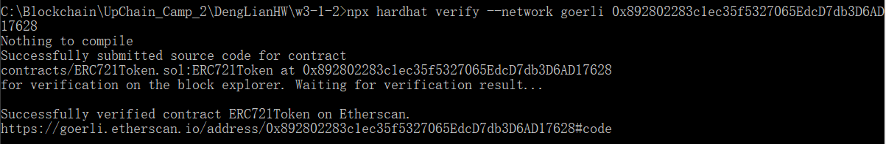
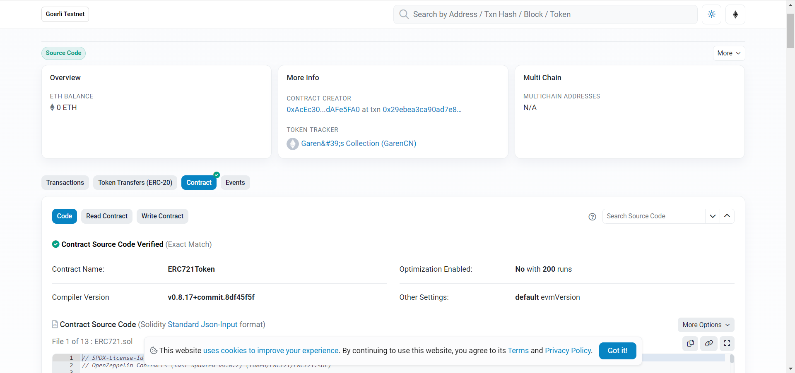
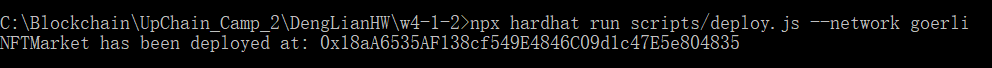
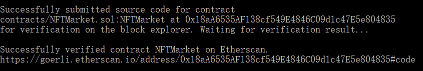
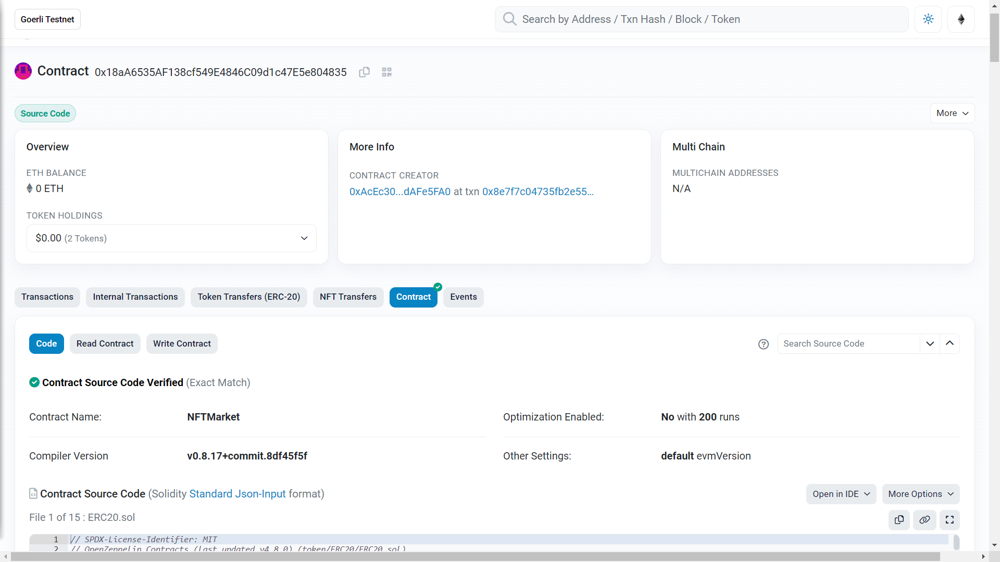
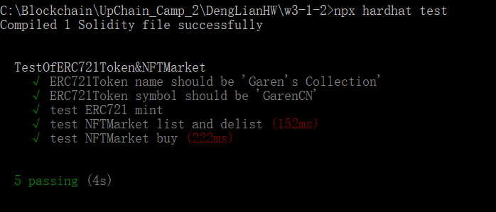
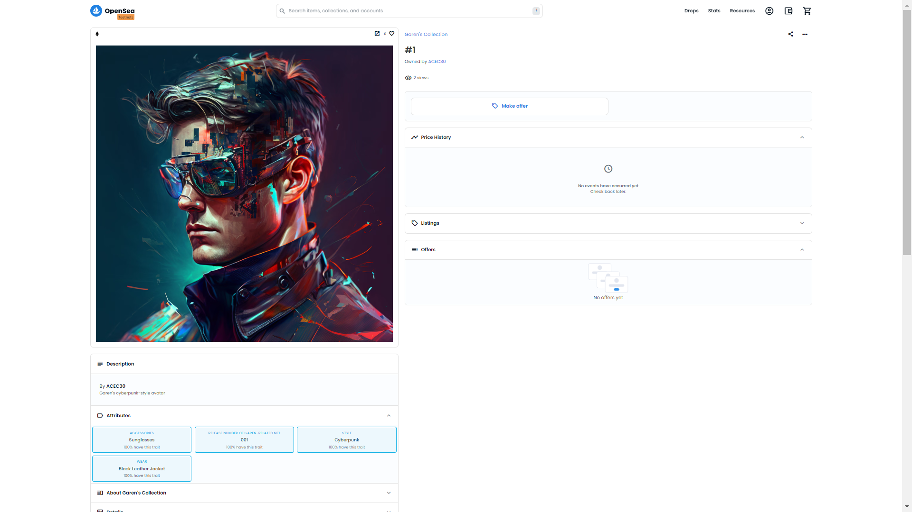

# 第 3 周第 1 课作业-第 2 个作业

## 1. 编写一个 ERC721 合约 发⾏ ERC721 Token<br>

  ERC721Token: Garen's Collection(GCN)<br><br>
  
  ```solidity
//SPDX-License-Identifier: MIT
pragma solidity ^0.8.0;

import "@openzeppelin/contracts/token/ERC721/extensions/ERC721URIStorage.sol";
import "@openzeppelin/contracts/utils/Counters.sol";

contract ERC721Token is ERC721URIStorage {
    using Counters for Counters.Counter;
    Counters.Counter private _tokenIds;
    address owner;

    constructor() ERC721("Garen's Collection", "GarenCN") {
        owner = msg.sender;
    }

    //  QmSz3n347TdH8nNEXfTrjB3oApUfzN3FGX8gUniGV21C4v
    function mint(address to, string memory tokenURI) public returns (uint256) {
        require(msg.sender == owner, "Only owner can mint");
        // let tokenId start from 1 instead of 0
        _tokenIds.increment();
        uint256 newItemId = _tokenIds.current();
        _mint(to, newItemId);
        _setTokenURI(newItemId, tokenURI);
        return newItemId;
    }
}
```
## 2. 编写⼀个合约：使⽤⾃⼰发⾏的ERC20 Token 来买卖NFT

 ```solidity
//SPDX-License-Identifier: MIT
pragma solidity ^0.8.0;

import "@openzeppelin/contracts/token/ERC20/IERC20.sol";
import "@openzeppelin/contracts/token/ERC721/IERC721Receiver.sol";
import "@openzeppelin/contracts/token/ERC721/IERC721.sol";

contract NFTMarket is IERC721Receiver {
    mapping(uint => uint) public price;
    mapping(address => uint) public income;
    mapping(uint => address) public realOwner;
    address public immutable tokenAddr;
    address public immutable nftAddr;
    error InvalidPrice();
    error NotOwner();
    error insufficientBidding();
    error NotOnSale();
    error withdrawalExceedIncome();

    constructor(address _tokenAddr, address _nftAddr) {
        tokenAddr = _tokenAddr;
        nftAddr = _nftAddr;
    }

    function onERC721Received(address operator, address from, uint256 tokenId, bytes calldata data) external override returns (bytes4) {
      return this.onERC721Received.selector;
    }

    function list(uint _tokenId, uint _price) external {
        if (msg.sender != IERC721(nftAddr).ownerOf(_tokenId)) revert NotOwner();
        if (_price == 0) revert InvalidPrice();
        // in order to realize the function of delist, set a mapping to record the real owner.
        // if not, the real owner cannot be captured by ownerOf() after the completion of list.
        realOwner[_tokenId] = msg.sender;
        IERC721(nftAddr).safeTransferFrom(msg.sender, address(this), _tokenId, "list success");
        price[_tokenId] = _price;
    }

    function delist(uint256 _tokenId) external {
        // only the real owner can delist the NFT.
        if (msg.sender != realOwner[_tokenId]) revert NotOwner();    
        if (IERC721(nftAddr).ownerOf(_tokenId) != address(this)) revert NotOnSale(); 
        IERC721(nftAddr).safeTransferFrom(address(this), msg.sender, _tokenId, "delist success");
        delete price[_tokenId];  
    }

    function buy(uint _tokenId, uint _bid) external {
        if (IERC721(nftAddr).ownerOf(_tokenId) != address(this)) revert NotOnSale(); 
        if (_bid < price[_tokenId]) revert insufficientBidding();
        bool _success = IERC20(tokenAddr).transferFrom(msg.sender, address(this), _bid);
        realOwner[_tokenId] = msg.sender;          // update the real owner when NFT was bought.
        if (_success) {
            income[IERC721(nftAddr).ownerOf(_tokenId)] += _bid;
        }
        IERC721(nftAddr).transferFrom(address(this), msg.sender, _tokenId);

    }

    function getPrice(uint _tokenId) external view returns (uint) {
        return price[_tokenId];
    }

    function getIncome() external view returns (uint) {
        return income[msg.sender];
    }

    function withdrawIncome(uint _value) external {
        if (_value > income[msg.sender]) revert withdrawalExceedIncome();
        IERC20(tokenAddr).transfer(msg.sender, _value);
        income[msg.sender] -= _value;
    }
}
```

## 3. ERC721Token合约与NFTMarket合约的编译、部署、测试、验证<br>

由于 w3-1-1 的ERC20 token是在 sepolia 网上部署的，而 OpenSea Testnet中看不到 sepolia 网的 NFT，故本次作业先将 ERC20token 合约部署在 Goerli 网上。
（ERC20 token 的合约地址需要在 NFTMarket 合约中作为参数使用，因而先部署 ERC20Token）<br>
ERC20TokenGTT:
https://goerli.etherscan.io/address/0xf29da8b25afa9db70542416e948597a0be57ec23#code

ERC721Token: 
https://goerli.etherscan.io/address/0x892802283c1ec35f5327065edcd7db3d6ad17628#code

NFTMarket: 
https://goerli.etherscan.io/address/0x18aA6535AF138cf549E4846C09d1c47E5e804835#code
( NFTMarket 合约已于 2023.4.16 更新：修复了一些 bug 并增强了一些功能。)

<br><br>

## 部署、验证： ERC721Token 和 NFTMarket
ERC721Token: Garen's Collection(GCN), network = Goerli<br>
Json IPFS URL: ipfs://QmSz3n347TdH8nNEXfTrjB3oApUfzN3FGX8gUniGV21C4v
<br><br>
ERC721Token:<br>
<br>
<br>
<br><br>
NFTMarket:<br>
<br>
<br>
<br><br>
测试：<br>
<br>

## 4. 在 OpenSea 上查看铸造的NFT
Json IPFS URL: ipfs://QmSz3n347TdH8nNEXfTrjB3oApUfzN3FGX8gUniGV21C4v<br><br>
NFT on OpenSea Testnet: <br><br>



