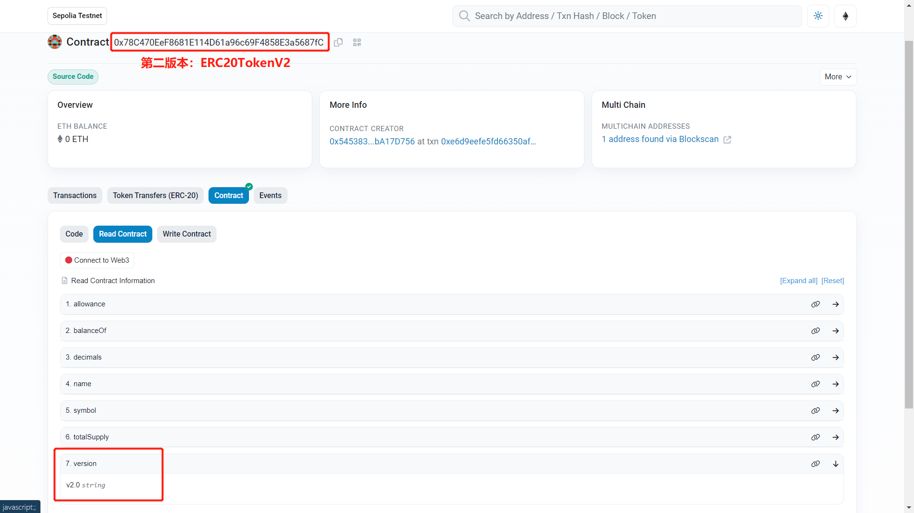
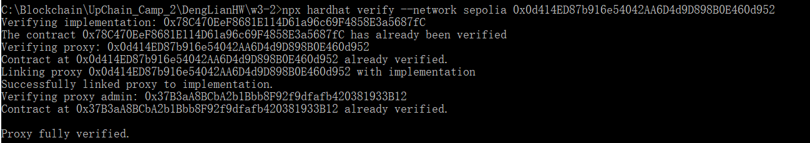

# 第 3 周第 2 课作业

## 1. 第一版本

### 1.1 合约文件 TestToken.sol：

```solidity
// SPDX-License-Identifier: MIT
pragma solidity ^0.8.1;

import "@openzeppelin/contracts-upgradeable/token/ERC20/ERC20Upgradeable.sol";
import "@openzeppelin/contracts-upgradeable/proxy/utils/Initializable.sol";

contract ERC20Token is ERC20Upgradeable {

    function initialize() public initializer {
        __ERC20_init("ERC20UpgradeableToken", "EUGT");
        _mint(msg.sender, 200000 * (10 ** uint256(decimals())));
    }

    function version() public pure returns (string memory) {
        return "v1.0";
    }
}

```

### 1.2 部署脚本 ERC20Tokendeploy.js：

```javascript
const { ethers, upgrades } = require("hardhat");
const { getImplementationAddress } = require('@openzeppelin/upgrades-core');

async function main() {
  console.log("Deploying ERC20Token ...");
  const ERC20TokenContract = await ethers.getContractFactory("ERC20Token");
  const proxy = await upgrades.deployProxy(ERC20TokenContract);       
  await proxy.deployed();
  console.log("proxy deployed to:", proxy.address);

  const currentImplAddress = await getImplementationAddress(ethers.provider, proxy.address);
  console.log(`implementation = ${currentImplAddress}\n`);

}

main()
  .then(() => process.exit(0))
  .catch(error => {
    console.error(error);
    process.exit(1);
  });
```

### 1.3 合约部署


### 1.4 impl(ERC20Token)合约验证


### 1.5 查看并验证代理合约

https://sepolia.etherscan.io/address/0x0d414ED87b916e54042AA6D4d9D898B0E460d952#readProxyContract


## 2. 第二版本

### 2.1 合约文件 TestTokenV2.sol：

```solidity
// SPDX-License-Identifier: MIT
pragma solidity ^0.8.1;

import "@openzeppelin/contracts-upgradeable/token/ERC20/ERC20Upgradeable.sol";
import "@openzeppelin/contracts-upgradeable/proxy/utils/Initializable.sol";
import "@openzeppelin/contracts-upgradeable/security/ReentrancyGuardUpgradeable.sol";
import "@openzeppelin/contracts/utils/Address.sol";


interface TokenRecipient {
    function tokensReceived(address sender, uint amount) external returns (bool);
}
/*
contract ReentrancyGuard {

    uint256 private constant _NOT_ENTERED = 1;
    uint256 private constant _ENTERED = 2;
    uint256 private _status;

    modifier nonReentrant() {
        _nonReentrantBefore();
        _;
        _nonReentrantAfter();
    }

    function _nonReentrantBefore() private {
        require(_status != _ENTERED, "ReentrancyGuard: reentrant call");

        _status = _ENTERED;
    }

    function _nonReentrantAfter() private {
        _status = _NOT_ENTERED;
    }
}
*/
contract ERC20TokenV2 is ERC20Upgradeable, ReentrancyGuardUpgradeable {
    using Address for address;

    function initialize() public initializer {
        __ERC20_init("ERC20UpgradeableToken", "EUGT");
        _mint(msg.sender, 200000 * (10 ** uint256(decimals())));
    }

    // to realize callback function in ERC20 Token
    function transferWithCallback(address recipient, uint256 amount) external nonReentrant returns (bool) {
        _transfer(msg.sender, recipient, amount);    
        if (recipient.isContract()) {                                                  
            bool success = TokenRecipient(recipient).tokensReceived(msg.sender, amount);
            require(success, "No tokensReceived");
        }
        return true;
    }

    function version() public pure returns (string memory) {
        return "v2.0";
    }
}

```

### 2.2 部署脚本 ERC20TokenV2deploy.js：

```javascript
const { ethers, upgrades } = require("hardhat");
const { getImplementationAddress } = require('@openzeppelin/upgrades-core');

async function main() {
  console.log("Upgrade ERC20Token to ERC20TokenV2 ...");
  const ERC20TokenV2Contract = await ethers.getContractFactory("ERC20TokenV2");  
  // proxy.address = 0x0d414ED87b916e54042AA6D4d9D898B0E460d952  
  const proxyAddr = "0x0d414ED87b916e54042AA6D4d9D898B0E460d952";    
  const proxy = await upgrades.upgradeProxy(proxyAddr, ERC20TokenV2Contract);
  await proxy.deployed();
  console.log("Upgrade complete");  
  console.log(`Proxy address: ${proxy.address} `);

  const currentImplAddress = await getImplementationAddress(ethers.provider, proxy.address);
  console.log(`implementation = ${currentImplAddress}\n`);

}

main()
  .then(() => process.exit(0))
  .catch(error => {
    console.error(error);
    process.exit(1);
  });
```

### 2.3 合约部署


### 2.4 impl(ERC20TokenV2)合约验证

<br>

<br>

其中，新版的 impl 增加了 transferWithCallback 方法：<br>


### 2.5 查看并验证代理合约

https://sepolia.etherscan.io/address/0x0d414ED87b916e54042AA6D4d9D898B0E460d952#readProxyContract


### 2.6 代理合约完整验证




