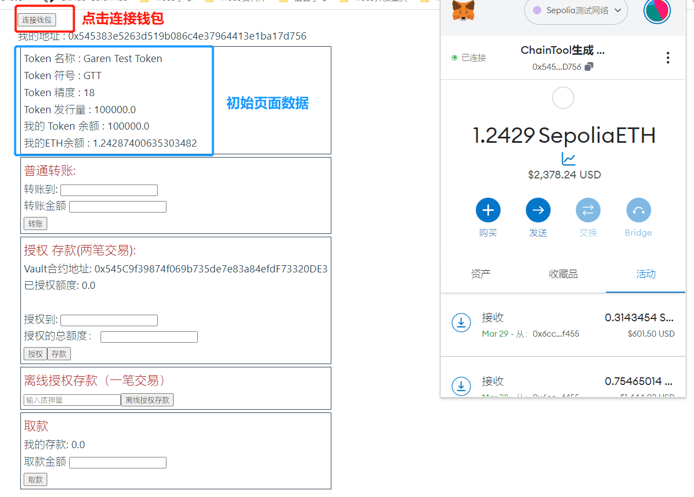

# 第三周第二次课作业

## 1. ERC20Token 合约与 Vault 合约的部署和验证

 

ERC20TokenGTT: 
https://sepolia.etherscan.io/address/0xE8193b6DEe2384533da99957Bb5bd38f3126B7a3 

Vault: 
https://sepolia.etherscan.io/address/0x545C9f39874f069b735de7e83a84efdF73320DE3 

## 2 前端页面连接钱包

账户1（部署者）：0x545383E5263D519B086C4e37964413e1bA17D756 

连接上钱包后的初始页面如下： 
 

## 3 通过前端调用 transfer 方法转账

账户2：0x41042630a3c4b91e946dE7A36871E950C9F9cFf4 

账户1 给 账户2 转账 25000 GTT: 
 

结果如下： 
 

## 4 通过前端调用 ERC20 approve + deposit 方法与合约交互（两笔交易）

账户1向 vault 合约中存入 30000 GTT。 
### 第 1 步：先验证（approve）
 

结果如下： 
 

### 第 2 步：再存入（deposit）
 

结果如下： 
 

## 5 使用 ERC2612 离线授权交易与合约交互（一笔交易）

账户1向 vault 合约中存入 12000 GTT。 
### 第 1 步：先离线签名授权
 
### 第 2 步：再执行交易
 

结果如下： 
 

## 6 取款
账户1从 vault 合约中取款，数额可指定： 
此处取出 40000 GTT
 

结果如下： 
 

-------------------------------------------  END  -------------------------------------------

