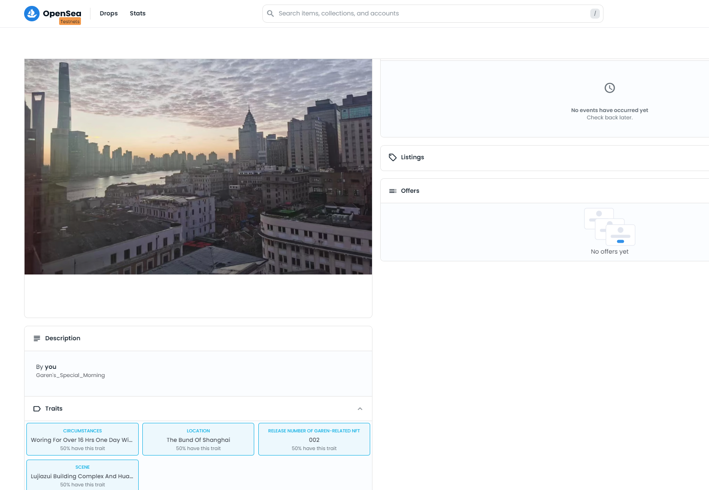
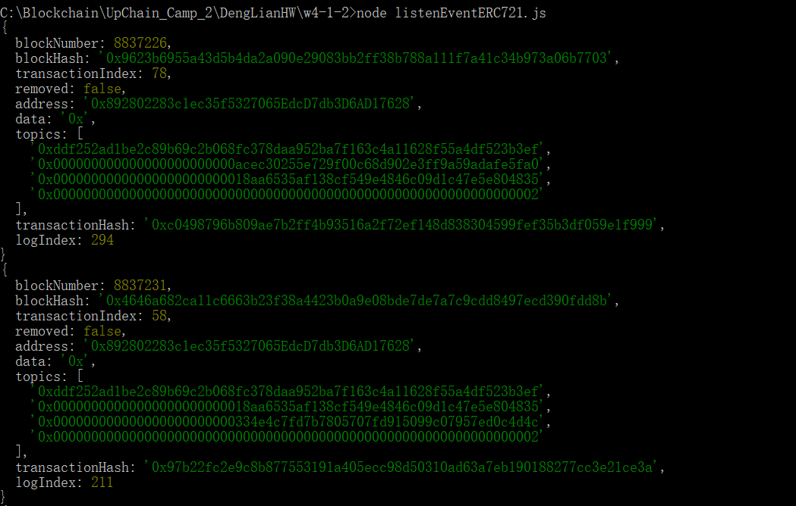
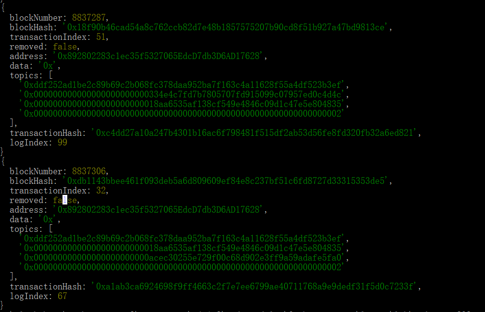

# 第四周第一次课第 2 个作业


## 利用已部署的合约完成 ERC721 转账
   之前已完成 w3-1-2 作业：已部署的三个合约 ERC20 token(GTT), ERC721 token 和 NFTMarket。<br>
   
ERC20TokenGTT: https://goerli.etherscan.io/address/0xf29da8b25afa9db70542416e948597a0be57ec23

ERC721Token: https://goerli.etherscan.io/address/0x892802283c1ec35f5327065edcd7db3d6ad17628

NFTMarket: https://goerli.etherscan.io/address/0x18aA6535AF138cf549E4846C09d1c47E5e804835<br>
(注：该合约与 w3-1-2 中初始的 NFTMarket 合约不同，已修正了一些 bug 并增强了一些功能，且在 w3-1-2 中同步更新此版合约）

## 0. 前置条件
1). 让购买者账户拥有足够金额的 ERC20 token(GTT)，用于调用 NFTMarmket 合约购买 ERC721 token。<br>
2). 购买者账户为 NFTMarket 合约地址授权足够的  ERC20 token(GTT)。<br>
3). ERC721 token 的持有者授权 NFTMarket 合约地址作为待转账 ERC721 token 的 operator。<br>
<br>
## 1. 待转账的 ERC721 Token
   本次作业用到的 ERC721 token 为新 mint 的 NFT(Garen's Collection, #2)。在合约 NFTMarket 中进行转账，使用 GTT 作为交易 token。<br>
   NFT(Garen's Collection, #2):<br>
   metadata: ipfs://QmYZTLMirkutn3WmGT7vcCaCMaScYXrdhh5jng3z9tqYdz<br>
   https://testnets.opensea.io/assets/goerli/0x892802283c1ec35f5327065edcd7db3d6ad17628/2<br>
   <br>
   <br>
## 2. 转账交易
   账户地址1（初始持有者）：0xAcEc30255e729F00C68D902e3Ff9A59adAFe5FA0<br>
   账户地址2（购买者）：0x334e4C7Fd7B7805707fD915099C07957ED0C4d4C<br>
   转账操作：账户地址2 购买这个 NFT，并在之后被账户地址1 购回。<br>
## 3. 监听并解析 ERC721 Token 转账事件
   代码如下：
   ```javascript
   const { ethers } = require("ethers");

const ERC721TokenAbi = require(`./deployments/abi/ERC721Token.json`)
const ER721TokenDev = require(`./deployments/dev/ERC721Token.json`)

async function parseTransferEvent(event) {
    const TransferEvent = new ethers.utils.Interface(["event Transfer(address indexed from, address indexed to, uint256 tokenId)"]);
    let decodedData = TransferEvent.parseLog(event);
    console.log("from:" + decodedData.args.from);
    console.log("to:" + decodedData.args.to);
    console.log("tokenId:" + decodedData.args.tokenId.toString());
    console.log("event signature: " + event.topics[0]);
    console.log("event data: " + event.data);

}

async function main() {
    const provider = new ethers.providers.JsonRpcProvider("https://goerli.infura.io/v3/9aa3d95b3bc440fa88ea12eaa4456161");
    let ERC721TokenContract = new ethers.Contract(ER721TokenDev.address, ERC721TokenAbi, provider);
    let filter = ERC721TokenContract.filters.Transfer();

    //In fact, transactions occured in the range of 8837212~8837306, which is obtained on Goerli etherscan.
    filter.fromBlock = 8837200;
    filter.toBlock = 8837400;

    let events = await provider.getLogs(filter);
    for (let i = 0; i < events.length; i++) {
        console.log(events[i]);
        parseTransferEvent(events[i]);
    }
}

main()
   ```
   
   共计包含 4 笔 ERC721 Token 的转账交易：<br>
   (1) 账户地址1 调用 NFTMarket 合约中的 list 函数，产生了一笔转账交易：from 账户地址1, to NFTMarket, tokenId = 2 ；<br>
   (2) 账户地址2 调用 NFTMarket 合约中的 buy 函数，产生了一笔转账交易：from NFTMarket, to 账户地址2, tokenId = 2 ；<br>
   (3) 账户地址2 调用 NFTMarket 合约中的 list 函数，产生了一笔转账交易：from 账户地址2, to NFTMarket, tokenId = 2 ；<br>
   (4) 账户地址1 调用 NFTMarket 合约中的 buy 函数，产生了一笔转账交易：from NFTMarket, to 账户地址1, tokenId = 2 ；<br>
   <br>
   <br>


----------------------------- 正在完成中，预计 4.14 完成该作业 -----------------------------
