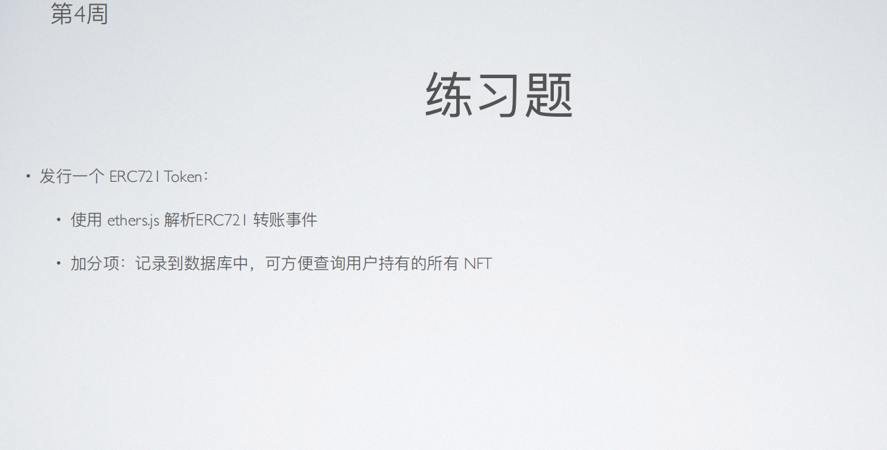

# 第四周第一次课第 2 个作业

## 前置条件
   利用之前完成的 w3-1-2 作业已部署的 ERC20 token(GTT) 和 NFTMarket。 
   本次作业对 ERC721 token 的转账在合约 NFTMarket 中进行，使用 GTT 作为交易 token。 
   本次作业用到的 ERC721 token 为新 mint 的。 
   
   metadata: ipfs://QmYZTLMirkutn3WmGT7vcCaCMaScYXrdhh5jng3z9tqYdz 

ERC20TokenGTT: https://goerli.etherscan.io/address/0xf29da8b25afa9db70542416e948597a0be57ec23#code

ERC721Token: 

NFTMarket: https://goerli.etherscan.io/address/0x6315e37AaE5D61F5a2e0dAe3423B46BF1bE9677b#

----------------------------- 正在完成中，预计 4.14 完成该作业 -----------------------------
