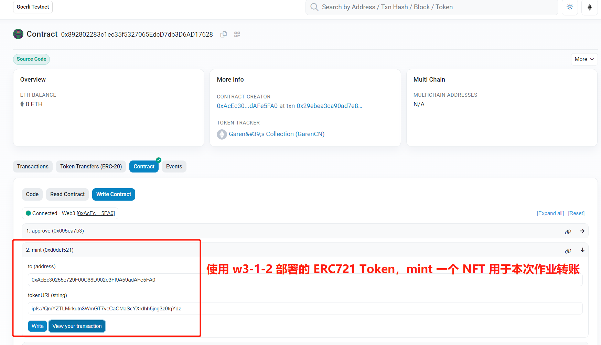

# 第四周第一次课第 2 个作业

## 前置条件
   之前已完成 w3-1-2 作业：已部署的三个合约 ERC20 token(GTT), ERC721 token 和 NFTMarket。 
   
ERC20TokenGTT: https://goerli.etherscan.io/address/0xf29da8b25afa9db70542416e948597a0be57ec23#code

ERC721Token: https://goerli.etherscan.io/address/0x892802283c1ec35f5327065edcd7db3d6ad17628#code

NFTMarket: https://goerli.etherscan.io/address/0x6315e37AaE5D61F5a2e0dAe3423B46BF1bE9677b#
 
## ERC721 token 转账
   本次作业用到的 ERC721 token 为新 mint 的 NFT(Garen's Collection, #2)。在合约 NFTMarket 中进行转账，使用 GTT 作为交易 token。 
      
   NFT(Garen's Collection, #2): 
   metadata: ipfs://QmYZTLMirkutn3WmGT7vcCaCMaScYXrdhh5jng3z9tqYdz 
   https://testnets.opensea.io/assets/goerli/0x892802283c1ec35f5327065edcd7db3d6ad17628/2 
   

----------------------------- 正在完成中，预计 4.14 完成该作业 -----------------------------
