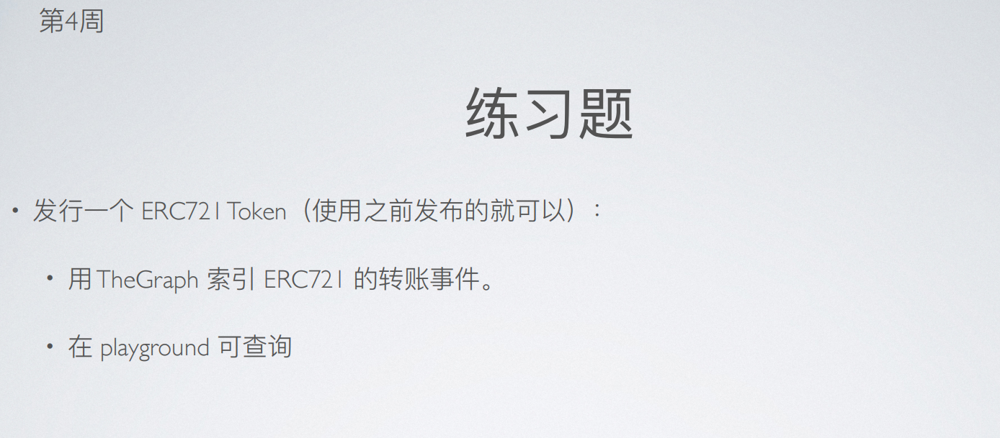
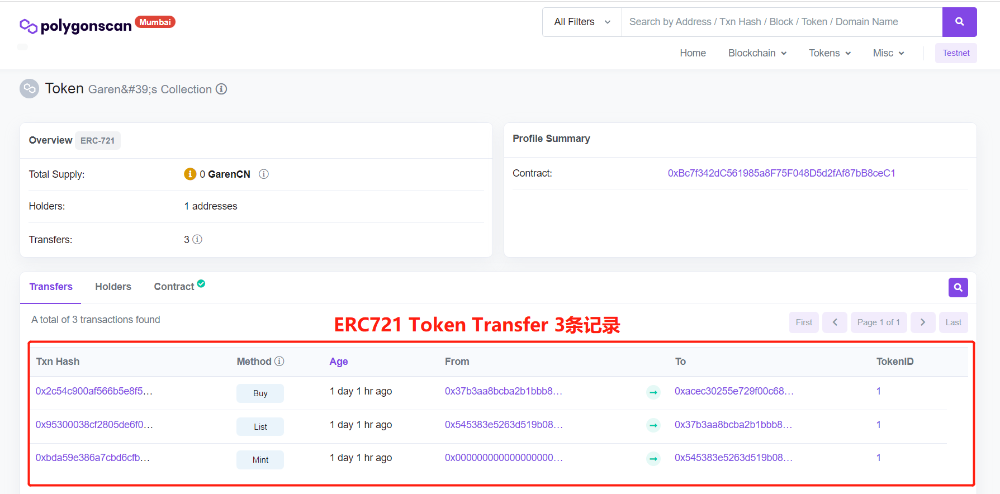
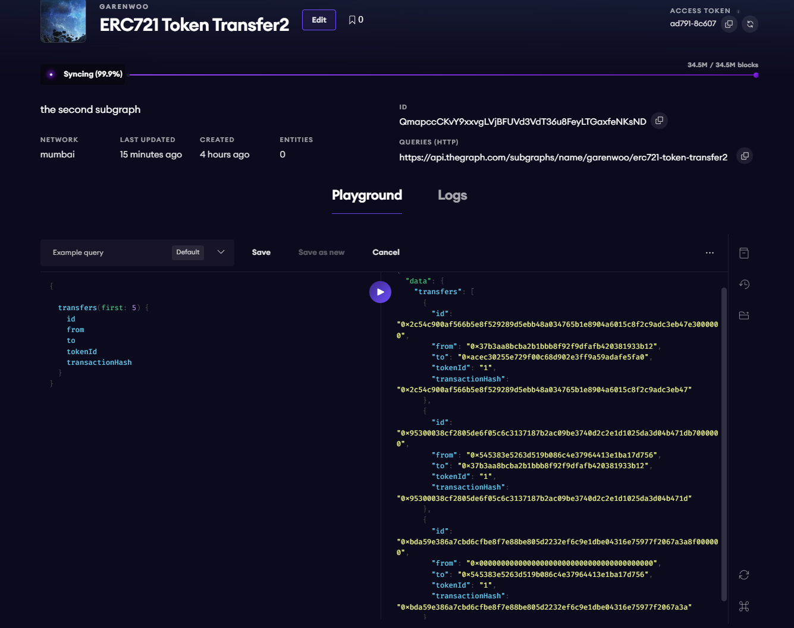

# 第 4 周第 2 课作业-第 1 个作业

## 1. 使用已部署的合约完成 ERC721 Token 转账
ERC721 Token 地址：https://mumbai.polygonscan.com/address/0xbc7f342dc561985a8f75f048d5d2faf87bb8cec1

NFTMarket 合约地址：https://mumbai.polygonscan.com/address/0x37B3aA8BCbA2b1Bbb8F92f9dfafb420381933B12#code

用户地址 1 ：0x545383E5263D519B086C4e37964413e1bA17D756

用户地址 2 ：0xAcEc30255e729F00C68D902e3Ff9A59adAFe5FA0

用户地址1 给自己 mint #1 NFT，然后再上架至 NFTMarket 合约，再由用户地址2 买下，共计 3 笔交易。

## 2. The Graph Playground 查询的事件

