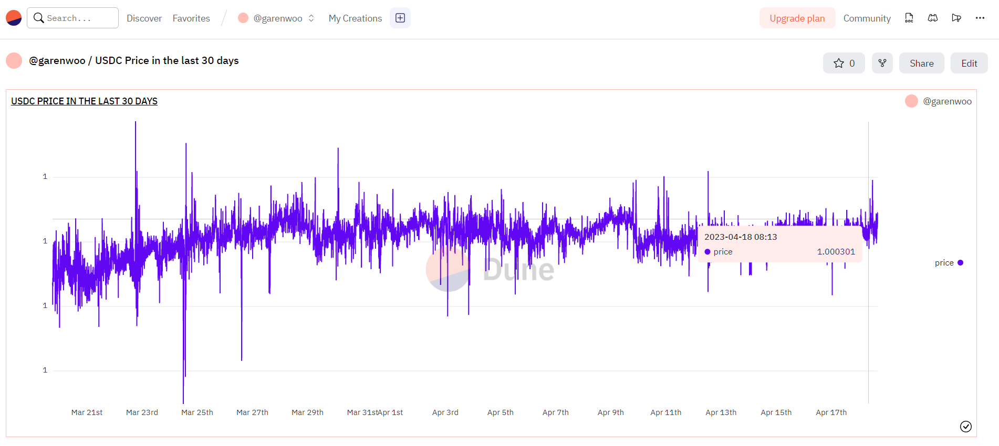
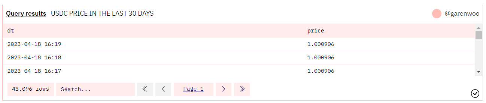

# 第 4 周第 2 课作业-第 2 个作业

## 1. DUNE 创建新的 Query 并写入 SQL 查询条件
Query URL: https://dune.com/queries/2383455

```SQL
SELECT
  minute as dt,
  price
FROM
  prices.usd
WHERE
  blockchain = 'ethereum'
  AND symbol = 'USDC'
  AND minute > now() - interval '30' day
ORDER BY
  minute DESC
```
## 2. DUNE 查询结果与图表
USDC 过去30天的价格变化：





DUNE Dashboard URL：

https://dune.com/garenwoo/usdc-price-in-the-last-30-days
