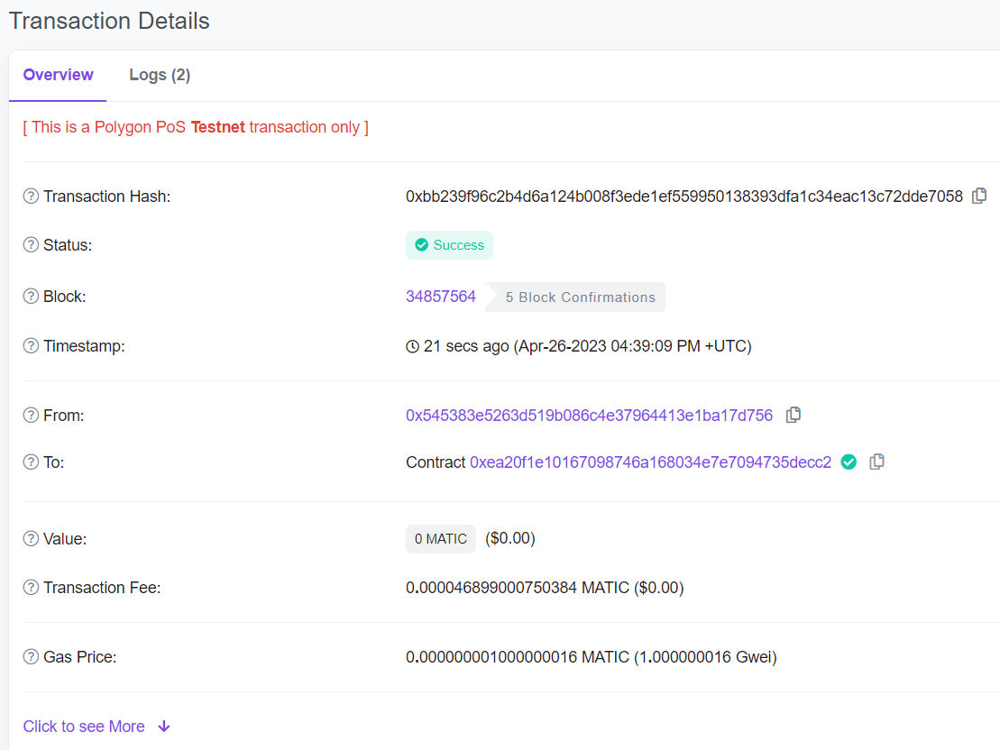

# 第 4 周第 1 课作业-第 1 个作业

## 前置条件: 已部署的合约地址（Mumbai测试网）与账户地址
1.ERC20Token<br>
https://mumbai.polygonscan.com/address/0xea20f1e10167098746a168034e7e7094735decc2#code<br>

2. SelfishVault（以下均称 Vault 合约）<br>
https://mumbai.polygonscan.com/address/0x6381e570debf4fffa3d52f53cde20074b3dffa94#code<br>

3. AutoCollectUpKeep<br>
https://mumbai.polygonscan.com/address/0xbCB1A7cEd47d9dB2381c6d5F8ea30356Ff4F68cB#code<br>

```
pragma solidity ^0.8.0;

import "@openzeppelin/contracts/token/ERC20/IERC20.sol";
import "./automation/AutomationCompatible.sol";


interface IVault {
    function collect(uint256 amount) external;
}

contract AutoCollectUpKeep is AutomationCompatible {
  address public immutable token;
  address public immutable vault;

  constructor(address _token, address _vault) {
        token = _token;
        vault = _vault;

  }

  function checkUpkeep(bytes calldata checkData) external view override returns (bool upkeepNeeded, bytes memory performData) {
    // upkeepNeeded = (block.timestamp - lastTimeStamp) > interval;
    
    if(IERC20(token).balanceOf(vault) > 100e18) {
      upkeepNeeded = true;
    }

    // performData = abi.decode();
  }


  function performUpkeep(bytes calldata performData) external override {
    if(IERC20(token).balanceOf(vault) > 100e18) {
      IVault(vault).collect((IERC20(token).balanceOf(vault) - (IERC20(token).balanceOf(vault) % 2)) / 2);
    }
  }

}
```

账户1地址：0x334e4C7Fd7B7805707fD915099C07957ED0C4d4C<br>
账户2地址：0x545383E5263D519B086C4e37964413e1bA17D756<br>
SelfishVault owner：0xd9741be0139122D03FDB7de30bD2ADf6AE720d74<br>

## 1. 账户1 向 Vault 合约 存入 99 GTT
<br>

<br>
URL: https://mumbai.polygonscan.com/tx/0x48d39192e99b3d5cfaca7d7655986b4a5d9742bf9bcbec4b25f34918d2c1d9be<br>

<br>

<br>
URL: https://mumbai.polygonscan.com/tx/0xa84944a6e25963d6b356112b1484b20150f5e43d2d4d8c92515f0ae11c9eabc2<br>

此时 Vault 合约中的存款总额为 99 GTT。<br>
查看 Chainlink Automation Upkeep 是否有发起自动调用：


存款小于 100 GTT，未执行自动调用，正确。<br>

## 2. 账户2 向 Vault 合约 存入 2 GTT
<br>

<br>
URL: https://mumbai.polygonscan.com/tx/0xbb239f96c2b4d6a124b008f3ede1ef559950138393dfa1c34eac13c72dde7058<br>

<br>

<br>
URL: https://mumbai.polygonscan.com/tx/0xb03883b12bde0447cafc66b366c5d7817d2390f983587786b8cdb5d580b710d2<br>

此时 Vault 合约中的存款总额为 101 GTT。<br>
再次查看 Chainlink Automation Upkeep 是否有发起自动调用：


<br>

存款总额为 101 GTT 大于 100 GTT，已执行自动调用，给 owner 转账 101 /2 = 50.5 GTT，正确。<br>

-------------------------------------------  END  -------------------------------------------

