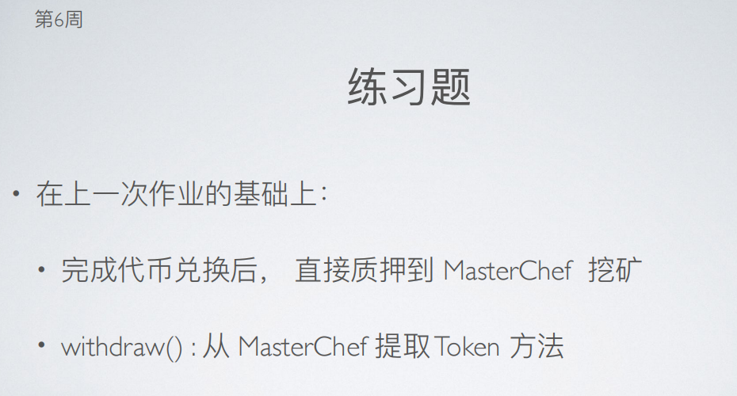

# 第 6 周第 1 课作业

## 前置条件：部署 UniswapV2 基础合约

合约部署网络：Sepolia

1. UniswapV2Factory: <br>
https://sepolia.etherscan.io/address/0x12F335B9557D2750b970e6e385dE8a6fEfeEc82B#code<br>

2. WTH9:<br>
https://sepolia.etherscan.io/address/0x6315e37AaE5D61F5a2e0dAe3423B46BF1bE9677b#code<br>

3. UniswapV2Router01:<br>
https://sepolia.etherscan.io/address/0x74baE07F5257Df25D5D1959B12a305e9C8a80AB4#code<br>

4. TokenA(MTK):<br>
https://sepolia.etherscan.io/address/0xEd2EE4fb17cC75786AAc25c85b297fdC43A9D511#code<br>

5. TokenB(GTT):<br>
https://sepolia.etherscan.io/address/0x5eB1366D5EbC60292b190718F658B32Ccc4332A5#code<br>

6. SushiToken:<br>
https://sepolia.etherscan.io/address/0x8c1613a7C8926a35d7f02f2B32027FeE40f56BA5#code<br>

7. MasterChef:<br>
https://sepolia.etherscan.io/address/0xa31a3B19910d0B4F1E8f0932591E26ce61300239#code<br>

8. MyTokenMarket:<br>
https://sepolia.etherscan.io/address/0xAA70cA6B7c953410f3B4cbf6e65FeBd0427732B9#code<br>

## MyTokenMarket合约
```solidity
//SPDX-License-Identifier: MIT
pragma solidity ^0.8.0;

import "./Uniswap/interfaces/IUniswapV2Router01.sol";
import "./IMasterChef.sol";

import "@openzeppelin/contracts/token/ERC20/IERC20.sol";
import "@openzeppelin/contracts/token/ERC20/utils/SafeERC20.sol";

contract MyTokenMarket {
    using SafeERC20 for IERC20;

    address public router;
    address public weth;
    address public sushi;
    address public masterchef;
    uint public depsited;

    constructor(address _router, address _weth, address _sushi, address _masterchef) {
        router = _router;
        weth = _weth;
        sushi = _sushi;
        masterchef = _masterchef;
    }

    // 添加流动性：token 与 ETH
    function AddLiquidityETH(address token, uint tokenAmount) public payable {
        IERC20(token).safeTransferFrom(msg.sender, address(this),tokenAmount);
        IERC20(token).safeApprove(router, tokenAmount);

        // ingnore slippage
        // (uint amountToken, uint amountETH, uint liquidity) = 
        IUniswapV2Router01(router).addLiquidityETH{value: msg.value}(token, tokenAmount, 0, 0, msg.sender, block.timestamp);

        //TODO: handle left
    }

    // 添加流动性: tokenA 与 tokenB
    function AddLiquidity(address tokenA, uint amountA, address tokenB, uint amountB) public {
        IERC20(tokenA).safeTransferFrom(msg.sender, address(this), amountA);
        IERC20(tokenA).safeApprove(router, amountA);

        IERC20(tokenB).safeTransferFrom(msg.sender, address(this), amountB);
        IERC20(tokenB).safeApprove(router, amountB);

        IUniswapV2Router01(router).addLiquidity(tokenA, tokenB, amountA, amountB, 0, 0, msg.sender, block.timestamp);

        //TODO: handle left
    }

    // 用 ETH 购买 token
    function buyTokenWithETH(address token, uint minTokenAmount) public payable {
        address[] memory path = new address[](2);
        path[0] = weth;
        path[1] = token;
        IUniswapV2Router01(router).swapExactETHForTokens{value : msg.value}(minTokenAmount, path, address(this), block.timestamp);
        uint amount = IERC20(token).balanceOf(address(this));

        IERC20(token).safeApprove(masterchef, amount);
        IMasterChef(masterchef).deposit(0, amount);
        depsited += amount;
    }

   // 用 tokenA 购买 tokenB
    function buyToken(address tokenA, address tokenB, uint amountIn, uint minTokenAmount) public {
        address[] memory path = new address[](2);
        path[0] = tokenA;
        path[1] = tokenB;
        IERC20(tokenA).safeTransferFrom(msg.sender, address(this), amountIn);
        IERC20(tokenA).safeApprove(router, amountIn);
        IUniswapV2Router01(router).swapExactTokensForTokens(amountIn, minTokenAmount, path, address(this), block.timestamp);
        uint amount = IERC20(tokenB).balanceOf(address(this));

        IERC20(tokenB).safeApprove(masterchef, amount);
        IMasterChef(masterchef).deposit(0, amount);
        depsited += amount;
    }

    function withdraw(address token) public {
        IMasterChef(masterchef).withdraw(0, depsited);
        IERC20(token).safeTransfer(msg.sender, depsited);

        uint amount = IERC20(sushi).balanceOf(address(this));
        IERC20(sushi).safeTransfer(msg.sender, amount);

    }
}
````
## 部署脚本
```javascript
// We require the Hardhat Runtime Environment explicitly here. This is optional
// but useful for running the script in a standalone fashion through `node <script>`.
//
// You can also run a script with `npx hardhat run <script>`. If you do that, Hardhat
// will compile your contracts, add the Hardhat Runtime Environment's members to the
// global scope, and execute the script.
let { ethers } = require("hardhat");
let { writeAddr } = require('./artifact_log.js');
const delay = require('./delay.js');

function wait(ms) {
    return new Promise((resolve) => setTimeout(resolve, ms));
}
async function deploysushi() {
    let SushiToken = await ethers.getContractFactory("SushiToken");
    sushi = await SushiToken.deploy();
    await sushi.deployed();
  
    console.log("sushi has been deployed to:" + sushi.address);
  }
  
  async function deployMasterChef() {
    let MasterChefContract = await ethers.getContractFactory("MasterChef");
    let award = ethers.utils.parseUnits("40", 18);
  
    MasterChef = await MasterChefContract.deploy(sushi.address, award, 10);
    await MasterChef.deployed();
  
    console.log("MasterChef has been deployed to:" + MasterChef.address);
  }

async function main() {
    let [owner] = await ethers.getSigners();  

    await deploysushi();
    
    await wait(15000);
  
    await deployMasterChef();
  
    await wait(15000);
  
    let tx = await sushi.transferOwnership(MasterChef.address);
    await tx.wait();
    
    
    // The following constants are the addresses of the contracts that have already been deployed.
    const routerAddr = "0x74baE07F5257Df25D5D1959B12a305e9C8a80AB4";
    const wth9Addr = "0x6315e37AaE5D61F5a2e0dAe3423B46BF1bE9677b";

    // tokenA: MyToken(MTK)
    const MyTokenContract = await ethers.getContractFactory("MyToken")
    const tokenA = await MyTokenContract.deploy();
    await tokenA.deployed();
    const tokenAAddr = tokenA.address;
    console.log("MyToken has been deployed to: " + tokenAAddr);

    // tokenB: GTT
    const GTTContract = await ethers.getContractFactory("ERC20TokenGTT")
    const tokenB = await GTTContract.deploy();
    await tokenB.deployed();
    const tokenBAddr = tokenB.address;
    console.log("ERC20TokenGTT has been deployed to: " + tokenBAddr);     
    
    tx = await MasterChef.add(100, tokenBAddr, true);
    await tx.wait();

    const MyTokenMarketContract = await ethers.getContractFactory("MyTokenMarket");
    const MyTokenMarket = await MyTokenMarketContract.deploy(routerAddr, wth9Addr, sushi.address, MasterChef.address);
    await MyTokenMarket.deployed();
    console.log("MyTokenMarket has been deployed to: " + MyTokenMarket.address);

    // approve MyTokenMarket (ERC20)
    await tokenA.approve(MyTokenMarket.address, ethers.utils.parseUnits("50000",18));
    await tokenB.approve(MyTokenMarket.address, ethers.utils.parseUnits("50000",18));

    // add liquidity with tokenA-tokenB pair.
    let amountA = ethers.utils.parseUnits("100", 18);
    let amountB = ethers.utils.parseUnits("200", 18);
    console.log(`Add liquidity of tokenA-tokenB pair : [${amountA} tokenA and ${amountB} tokenB]`);
    await MyTokenMarket.AddLiquidity(tokenAAddr, amountA, tokenBAddr, amountB);
    
    // wait for the process of blockchain.
    await wait(15000);

    let amountIn = ethers.utils.parseUnits("50",18);
    let minTokenAmount = ethers.utils.parseUnits("10",18);
    let balancetokenA = await tokenA.balanceOf(owner.address);
    let balancetokenB = await tokenB.balanceOf(owner.address);
    console.log("Owner's balance of tokenA: " + ethers.utils.formatUnits(balancetokenA, 18));
    console.log("Owner's balance of tokenB: " + ethers.utils.formatUnits(balancetokenB, 18));
    console.log("AmountIn of tokenA: " + ethers.utils.formatUnits(amountIn, 18));
    console.log("MinTokenAmount of tokenB: " + ethers.utils.formatUnits(minTokenAmount, 18));
    await MyTokenMarket.buyToken(tokenAAddr, tokenBAddr, amountIn, minTokenAmount);

    // wait for the process of blockchain.
    await wait(15000);

    let depositedAmount = await tokenB.balanceOf(MasterChef.address);
    console.log(`Deposited amount of tokenB: ${ethers.utils.formatUnits(depositedAmount, 18)}`);
    
    await wait(20000);

    let pending = await MasterChef.pendingSushi(0, MyTokenMarket.address);
    console.log("get profits:" + ethers.utils.formatUnits(pending, 18));

    txWithdraw = await MyTokenMarket.withdraw(tokenBAddr);
    await txWithdraw.wait();

    sushiBalance = await sushi.balanceOf(owner.address);
    console.log("get sushi:" + ethers.utils.formatUnits(sushiBalance, 18));
}


// We recommend this pattern to be able to use async/await everywhere
// and properly handle errors.
main().catch((error) => {
    console.error(error);
    process.exitCode = 1;
});
```

## 添加流动性与购买token

