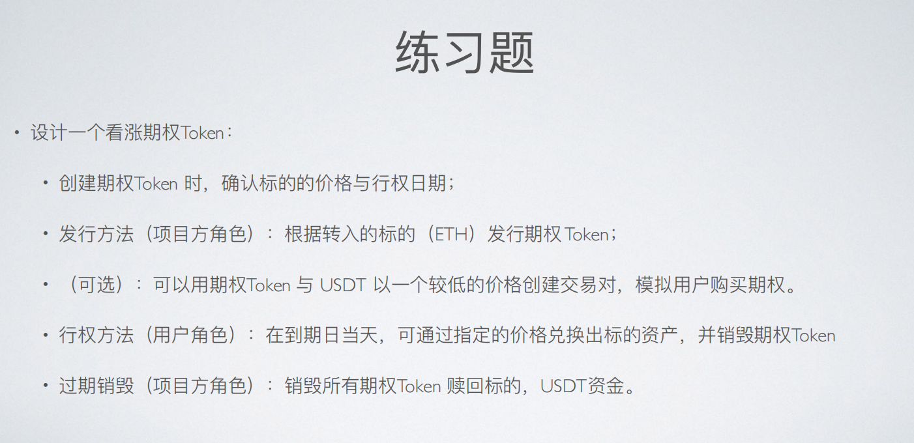

# 第 7 周第 1 课作业

部署合约（Sepolia测试网络）：

USDC: https://sepolia.etherscan.io/address/0x6206B71cB87381ebAf06d3C4707BE4D99D942896#code

CallOptToken: https://sepolia.etherscan.io/address/0x30eCBE79Dbd4E789276F75278af20101C263B707#code

流程：
1. 向期权合约中存入 ETH（onlyOwner），并获得期权token。
2. 在settlementTime过了之后且位于during的时间段内，可以行权。
3. 行权：使用掉一定数量的期权token，销毁对应的期权token（期权token数量 = price * amount），投入 USDC 到期权合约中（需提前在 USDC 合约中 approve 足量的 USDC 给期权合约）。
4. 将期权合约中对应数量的 ETH 发送给账户（ETH数量与期权token的比例：在合约注入ETH并返给用户期权token时在_mint方法中通过定义期权token的铸造数量来确定）。
5. 在合约 settlementTime + during 之后，Owner可以将所有的 USDC 收回并销毁该合约（ETH 同时收回）。

期权合约代码：

```solidity
//SPDX-License-Identifier: Unlicense
pragma solidity ^0.8.0;

import "@openzeppelin/contracts/token/ERC20/ERC20.sol";
import "@openzeppelin/contracts/access/Ownable.sol";
import "@openzeppelin/contracts/token/ERC20/utils/SafeERC20.sol";


// ETH Call Option
contract CallOptToken is ERC20, Ownable {
  using SafeERC20 for IERC20;


  address public udscToken;
  uint public settlementTime;
  uint public constant during = 1 days; // 1 day
  uint price;
  
  constructor(address _usdc, uint _price) ERC20("CallOptToken", "COPT") {
    udscToken = _usdc;
    price = _price;  
    settlementTime = block.timestamp + 10;
  }

  // 10 eth : 10^18; = 10^18 COPT
  // 10 COPT
  function mint() external payable onlyOwner {
    _mint(msg.sender,  msg.value);
  }

  // 10 COPT - USDT/ETH  PAIR v2 v3 
  // 1 COPT = 10 USDT 

  // amount: 0.5 COPT -> 0.5 ETH
  // usdc.approve(, needUsdcAmount); // 2612
  function settlement(uint amount) external {
    // 10.1 - 10.2
    require(block.timestamp >= settlementTime && block.timestamp < settlementTime + during, "invalid time");

    _burn(msg.sender, amount);

    uint needUsdcAmount = price * amount; // 5000 * 0.5 * 10 ^18;


    // 行权资金
    IERC20(udscToken).safeTransferFrom(msg.sender, address(this), needUsdcAmount);
    // 
    safeTransferETH(msg.sender, amount);
    // msg.sender.transfer(amount);  // 2300
  }

  // Uniswap
  function safeTransferETH(address to, uint256 value) internal {
    (bool success, ) = to.call{value: value}(new bytes(0));
    require(success, 'TransferHelper::safeTransferETH: ETH transfer failed');
  }

  function burnAll() external onlyOwner {
    require(block.timestamp >= settlementTime + during, "not end");
    uint usdcAmount = IERC20(udscToken).balanceOf(address(this));
    IERC20(udscToken).safeTransfer(msg.sender, usdcAmount);


    selfdestruct(payable(msg.sender));
    // uint ethAmount = address(this).balance;
    // safeTransferETH(msg.sender, ethAmount);
  }


}
```
