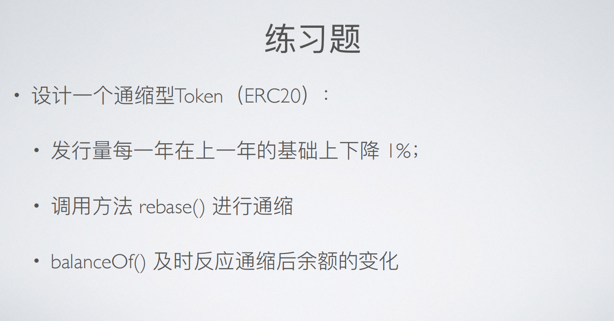
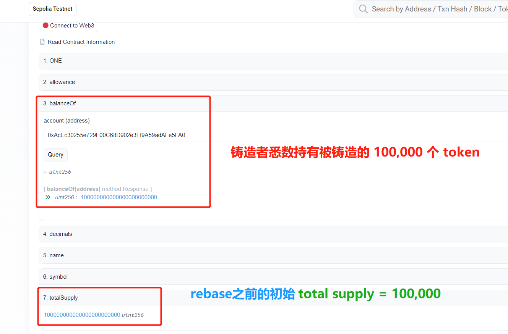
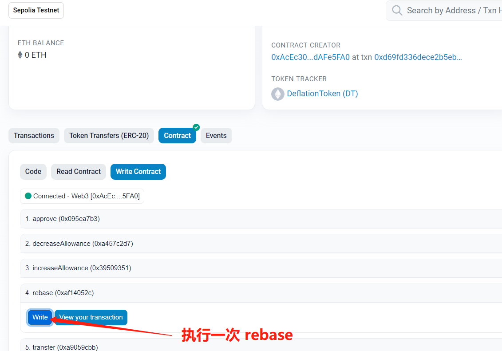
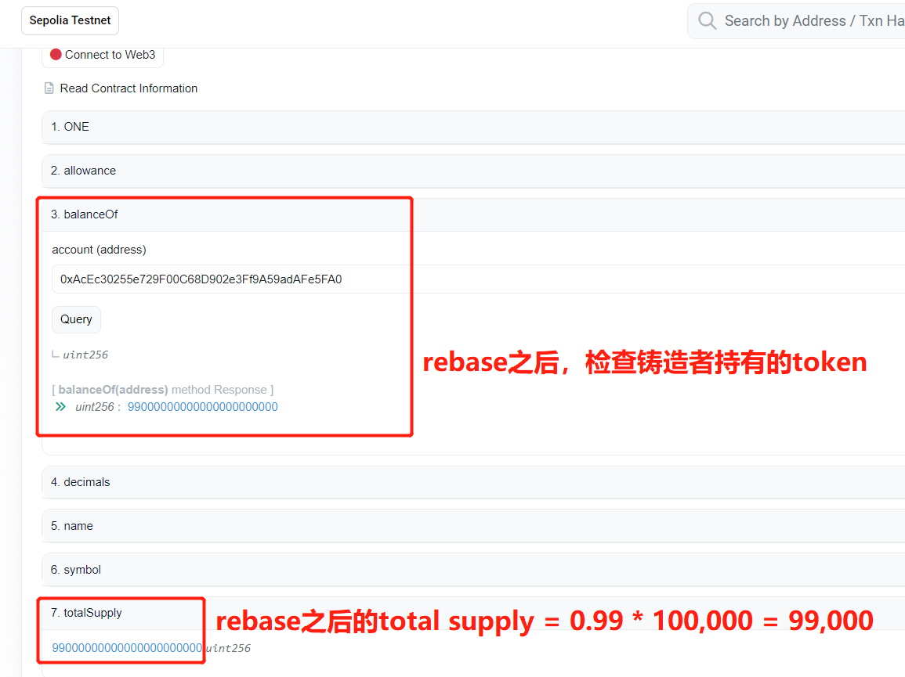
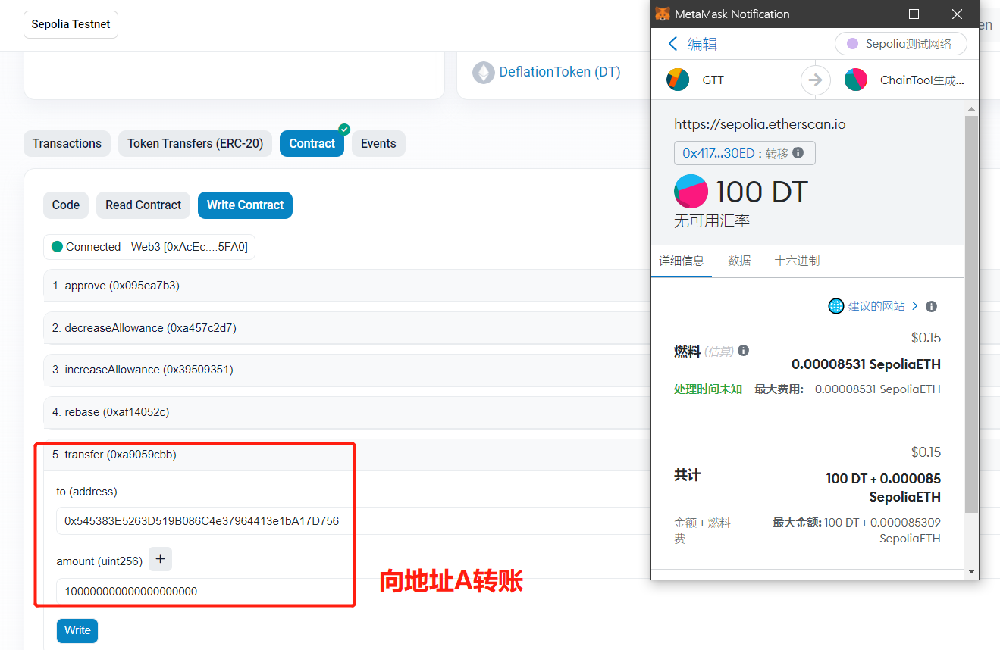
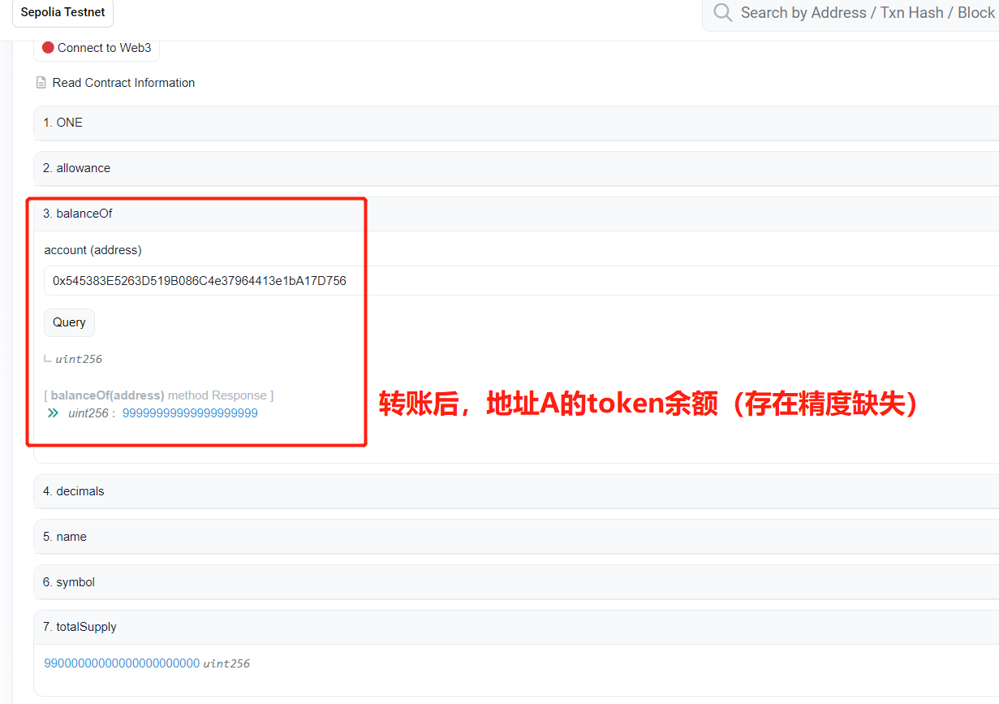
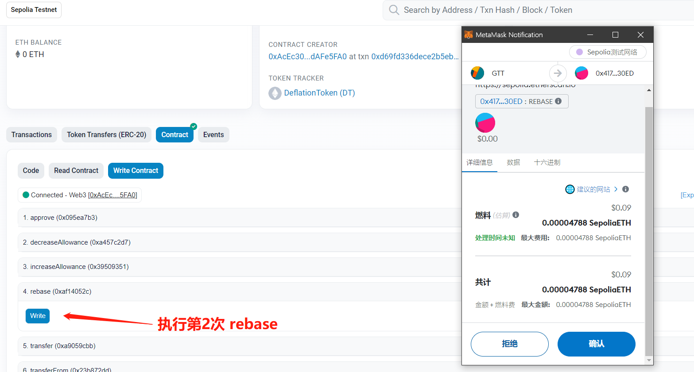
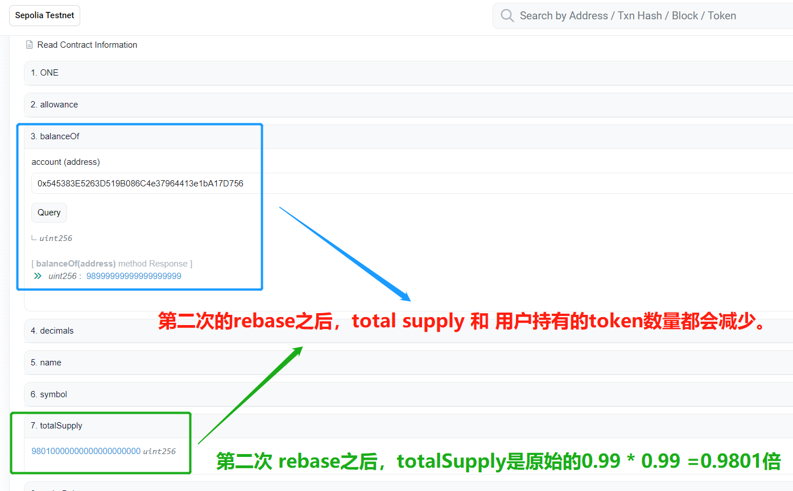

# 第 7 周第 2 课作业

## 合约代码
说明：原题目的通缩周期为 1 年，时间较久，本合约将通缩周期缩减为 1 秒。

```solidity
//SPDX-License-Identifier: Unlicense
pragma solidity ^0.8.0;

import "@openzeppelin/contracts/token/ERC20/ERC20.sol";

// ETH Call Option
contract DeflationToken is ERC20 {

  uint public ONE = 1e18;
  uint private factor = ONE;

  uint private lastRebaseTs;

  constructor( ) ERC20("DeflationToken", "DT") {
      _mint(msg.sender, 100000 * ONE);
      lastRebaseTs = block.timestamp;
  }

  function totalSupply() public override view returns (uint256) {
      return super.totalSupply() * factor /  ONE;
  } 

  function balanceOf(address account) public override view returns (uint256) {
    return super.balanceOf(account) * factor /  ONE;
  }

  function underBalance(uint256 amount) public view returns (uint256 b) {
      b = amount * ONE / factor;
  }

  function _transfer(
        address from,
        address to,
        uint256 amount
    ) internal override virtual {
        uint under = underBalance(amount);
        super._transfer(from, to , under);
    }


  function rebase() external {
    // set the duration of every rebase 
    if (block.timestamp - lastRebaseTs >= 1) {
      factor = factor * 99 / 100;
      lastRebaseTs = block.timestamp;
    }
  }
}
```
## 演示合约：通缩以及余额变化
1. 通缩前 token 的数量。



2. 执行第一次通缩。


3. 通缩之后查询 token 数量。


4. 给某一个地址（地址A）转账，用于后续查看通缩对该用户持有的该 token 的数量影响。


5. 检查转账后的账户A的token余额。


6. 执行第二次通缩。


7. 检查第二次通缩后的账户余额和 total supply。


